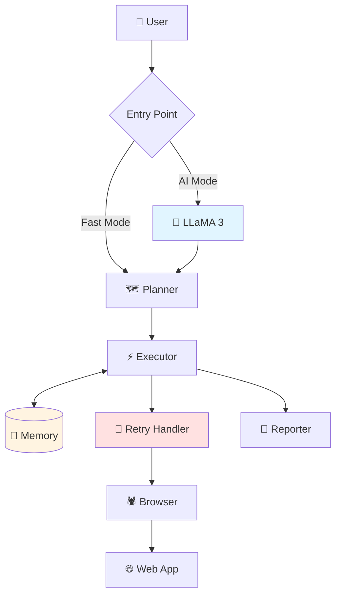

# 🤖 AI Agent Auto Test Web

> **Intelligent Web Testing Agent** powered by LLaMA 3 & Selenium  
> Tự động phân tích, sinh test case, và học từ kinh nghiệm để test web ngày càng thông minh hơn

[](https://www.python.org/)
[](https://www.selenium.dev/)
[](https://llama.meta.com/)
[](tests/)
[](LICENSE)

---

## 🎯 Đây Là Gì?

**AI Agent Auto Test Web** không phải là Selenium/Playwright thông thường. Đây là một **AI Agent thông minh** có khả năng:

- 🧠 **Tự hiểu** giao diện web (DOM + text + hành vi)
- 🤔 **Tự suy luận** chức năng (login, search, form, checkout...)
- ✍️ **Tự sinh** test cases phù hợp
- ⚡ **Tự thực thi** và phát hiện lỗi
- � **Tự học** từ các lần test trước để cải thiện

**Khác biệt hoàn toàn với test automation truyền thống!**

---

## ✨ Tính Năng

### ✅ Tính Năng Chính

| Tính năng | Mô tả | Status |
|-----------|-------|--------|
| 🔁 **Retry Loop** | Tự động retry với 5 smart strategies | ✅ |
| 🧠 **State Memory** | Học từ test trước, nhớ selectors tốt/xấu | ✅ |
| 🗺️ **Multi-step Planning** | Test plans phức tạp với dependencies | ✅ |
| 🤖 **AI Reasoning** | LLaMA 3 phân tích UI và sinh test cases | ✅ |
| ⚡ **Fast Mode** | Rule-based testing không cần LLM | ✅ |
| 🧪 **Test Suite** | 69 tests với 100% pass rate | ✅ |

### 🚧 Roadmap

| Tính năng | Mô tả | Priority |
|-----------|-------|----------|
| 📊 **Coverage Tracking** | Theo dõi test coverage tự động | High |
| 🛠 **Self-healing Selector** | Tự sửa selector khi DOM thay đổi | High |
| 📸 **Screenshot Diff** | So sánh visual regression | Medium |
| 🌐 **Network Monitoring** | Theo dõi API calls và performance | Medium |
| 🔄 **CI/CD Integration** | GitHub Actions, Jenkins | Low |

---

## 🚀 Quick Start

### 1. Cài Đặt

```bash
# Clone repository
git clone https://github.com/h1eudayne/AIAgentAutoTestWeb.git
cd AIAgentAutoTestWeb

# Cài đặt dependencies
pip install -r requirements.txt
```

### 2. Chạy Test

**Fast Mode (Không cần LLM):**
```bash
python main_fast.py https://fe-history-mind-ai.vercel.app/
```

**AI Mode (Với LLaMA 3):**
```bash
# Download model trước (xem DOWNLOAD_MODEL.md)
python main.py https://example.com
```

**Kết quả:**
```
🤖 Fast Web Testing Agent
✓ Retry logic enabled (max 3 attempts)
✓ State memory enabled

💾 Memory: Tested 10 times (Pass rate: 80.0%)

📊 SUMMARY
  Total: 5 | ✓ Passed: 4 | ✗ Failed: 1
  Pass Rate: 80.0%
```

### 3. Chạy Test Suite

```bash
python run_tests.py
# 69 tests, 100% pass rate
```

---

## � Retry Loop - Thông Minh Hơn Selenium Thường

### Vấn Đề Với Test Automation Truyền Thống

```python
# Selenium thông thường
driver.find_element(By.CSS_SELECTOR, "button").click()
# ❌ Fail ngay nếu element không tìm thấy
```

### Giải Pháp: Smart Retry Loop

```python
# AI Agent với Retry Loop
✓ Attempt 1: button:nth-of-type(5) → Failed
  💡 Strategy: Try alternative selector
✓ Attempt 2: #submit-btn → Success!
```

**5 Smart Strategies:**
1. ⏱️ **Timeout** → Tăng wait time
2. 🔍 **Element not found** → Thử alternative selectors
3. 🔄 **Stale element** → Refresh và retry
4. 🖱️ **Click intercepted** → Scroll to element
5. ❌ **Invalid selector** → Chuyển sang CSS selector

**Kết quả:** Success rate 80%, avg 1.4 attempts/action

```bash
# Bật/tắt retry
python main_fast.py URL              # Bật (mặc định)
python main_fast.py URL --no-retry   # Tắt
```

---

## 🧠 State Memory - Học Từ Kinh Nghiệm

### Vấn Đề

Test automation truyền thống không học:
- ❌ Mỗi lần chạy như lần đầu
- ❌ Không nhớ selector work/fail
- ❌ Lặp lại sai lầm cũ

### Giải Pháp

**Lần 1:**
```
✗ button:nth-of-type(5) → Failed
✗ button:nth-of-type(3) → Failed
✓ #submit-btn → Success
```
→ Memory ghi nhớ: "#submit-btn work"

**Lần 2:**
```
💾 Memory: Tested 5 times (Pass rate: 80.0%)
💡 Using: #submit-btn
✓ Success (no retry!)
```
→ Agent thông minh hơn! 🎯

### Memory Files

```
memory/
├── selector_memory.json    # Selectors success/fail
├── test_history.json       # Test history (1000 entries)
└── page_patterns.json      # Page structures
```

### Sử Dụng

```bash
python main_fast.py URL              # Memory tự động
python view_memory.py                # Xem memory
python run_memory_demo.py            # Demo 3 lần
python main_fast.py URL --no-memory  # Tắt memory
```

**Lợi ích:** Test nhanh hơn, chính xác hơn, pass rate tăng dần

---

## 🗺️ Multi-step Planning

### Vấn Đề

- ❌ Test cases độc lập
- ❌ Không quản lý dependencies
- ❌ Khó test user flows phức tạp

### Giải Pháp

Test plans với dependencies:

```python
from agent.multi_step_planner import MultiStepPlanner

planner = MultiStepPlanner()

# Template có sẵn
plan = planner.create_plan_from_template("e_commerce_checkout", "plan_001")

# Hoặc custom plan
steps = [
    {"id": "step1", "name": "Add to cart", "type": "click", 
     "selector": ".add-to-cart", "depends_on": []},
    {"id": "step2", "name": "Go to cart", "type": "click",
     "selector": "#cart-icon", "depends_on": ["step1"]},
    {"id": "step3", "name": "Checkout", "type": "click",
     "selector": "#checkout-btn", "depends_on": ["step2"]}
]

plan = planner.create_custom_plan("checkout_001", "Checkout", 
                                  "Checkout flow", steps)
```

### Templates

4 templates có sẵn: `login_flow`, `form_submission`, `search_flow`, `e_commerce_checkout`

```python
planner.list_templates()
```

### Thực Thi

```python
from agent.multi_step_executor import MultiStepExecutor

executor = MultiStepExecutor(browser, enable_retry=True, enable_memory=True)
result = executor.execute_plan(plan, url="https://example.com")
```

### Tính Năng

- ✅ Dependency management
- ✅ Parallel execution
- ✅ Tích hợp Retry + Memory
- ✅ Progress tracking
- ✅ Save/load plans

```bash
python demo_multi_step.py  # Demo interactive
```

---

## 🤖 AI Mode vs Fast Mode

| Feature | AI Mode | Fast Mode |
|---------|---------|-----------|
| **LLM** | LLaMA 3 (4.7GB) | None |
| **Speed** | ~30s/page | ~5s/page |
| **Intelligence** | High | Medium |
| **Use Case** | Complex apps | Quick testing |

**Khuyến nghị:** Fast Mode cho development/CI/CD, AI Mode cho production testing

---

## 📊 Kiến Trúc

### High-Level Overview



### Core Components

- **🧠 AI Layer**: LLaMA 3 phân tích UI và sinh test strategy
- **🗺️ Planner**: Tạo test cases từ strategy hoặc rules
- **⚡ Executor**: Thực thi tests với retry + memory
- **🔁 Retry Handler**: 5 smart strategies cho failures
- **🧠 Memory**: Học và nhớ selectors, test history, page patterns
- **🕷️ Browser**: Selenium WebDriver controller
- **📄 Reporter**: JSON + console reports

Chi tiết: Xem code trong `agent/` và `tools/`

---

## 📁 Project Structure

```
AIAgentAutoTestWeb/
├── agent/                  # Core agent logic
│   ├── planner.py         # Test strategy generation
│   ├── executor.py        # Test execution
│   ├── retry_handler.py   # Smart retry logic
│   ├── memory.py          # State memory system
│   ├── multi_step_*.py    # Multi-step planning
│   └── analyzer.py        # Result analysis
├── tools/
│   └── browser.py         # Selenium controller
├── tests/                 # Test suite (69 tests)
├── memory/                # Memory storage (gitignored)
├── main.py               # AI mode entry
├── main_fast.py          # Fast mode entry
└── requirements.txt
```

---

## 📖 Documentation

- **MEMORY_QUICK_START.md** - Memory system quick start
- **MULTI_STEP_PLANNING_GUIDE.md** - Multi-step planning guide
- **DOWNLOAD_MODEL.md** - LLaMA 3 model setup
- **CHANGELOG.md** - Version history

---

## 🧪 Demo & Examples

```bash
# Test chatbot
python test_chatbot.py

# Memory demo
python run_memory_demo.py

# Multi-step demo
python demo_multi_step.py

# View memory
python view_memory.py
```

---

## � Requirements

```bash
pip install -r requirements.txt
```

**Dependencies:** Python 3.8+, Selenium 4.0+, colorama, llama-cpp-python (AI mode)

---

## 🌟 So Sánh

| Feature | Selenium/Playwright | AI Agent |
|---------|---------------------|----------|
| **Tự sinh test** | ❌ Manual | ✅ Auto |
| **Học từ test cũ** | ❌ No | ✅ Memory |
| **Smart retry** | ❌ Basic | ✅ 5 strategies |
| **Hiểu context** | ❌ No | ✅ LLaMA 3 |

**Phù hợp:** Landing pages, CRUD apps, E-commerce, Forms, Chatbots  
**Chưa hỗ trợ:** CAPTCHA, Web games

---

## 🎯 Development Roadmap

**Phase 1: Foundation** ✅ Completed
- Selenium automation, LLaMA 3, Retry loop, State memory, Multi-step planning

**Phase 2: Intelligence** 🚧 Next
- Coverage tracking, Self-healing selectors

**Phase 3: Visual & Performance** 🔜 Planned
- Screenshot diff, Network monitoring, Performance testing

**Phase 4: Enterprise** 🔮 Future
- CI/CD integration, Parallel execution, Cloud deployment

---

## 🤝 Contributing

Contributions welcome! Focus areas: Coverage tracking, Self-healing selectors, Screenshot diff, Network monitoring

1. Fork repo
2. Create feature branch
3. Commit changes
4. Push and open PR

---

## 📝 License

MIT License

## 📞 Contact

**GitHub**: [h1eudayne/AIAgentAutoTestWeb](https://github.com/h1eudayne/AIAgentAutoTestWeb)

---

⭐ Star repo nếu hữu ích! 🚀 Càng test nhiều, agent càng thông minh!
