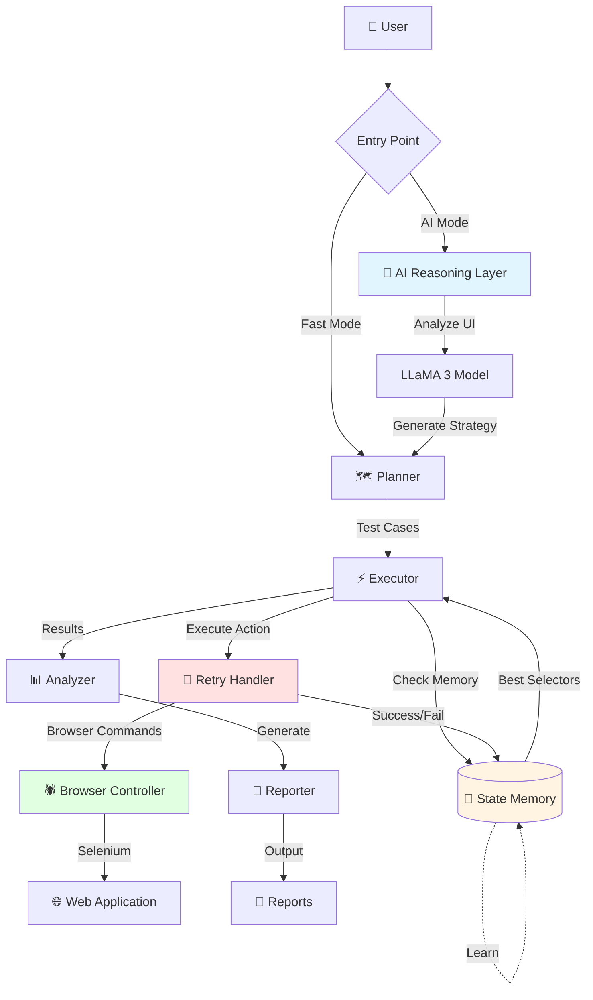
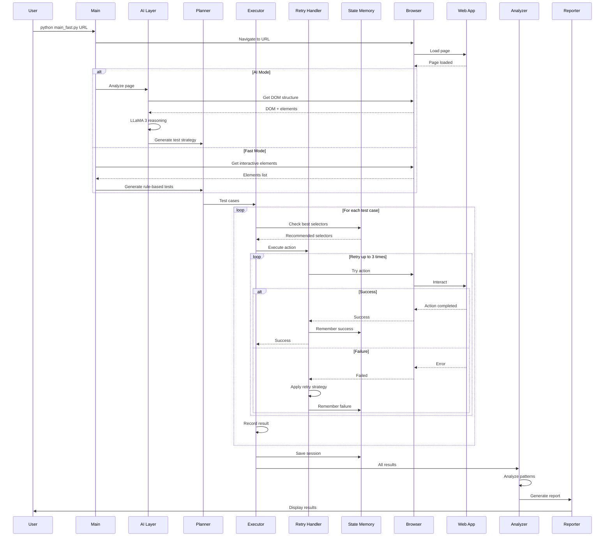
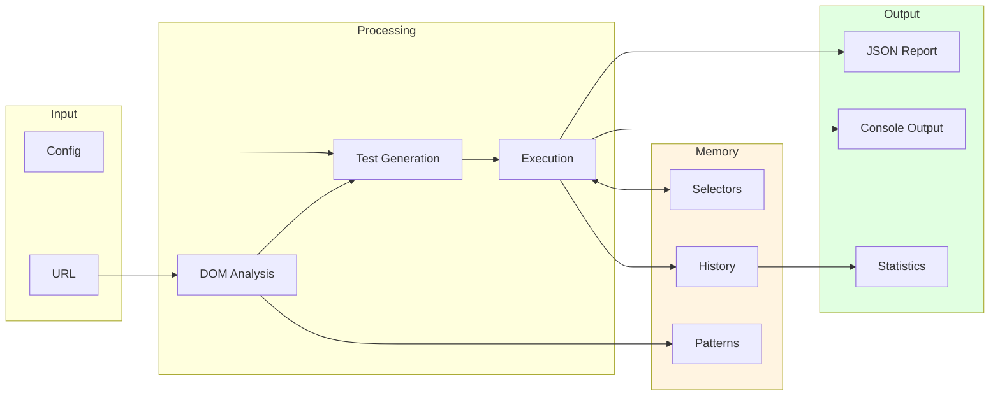

# 🤖 AI Agent Auto Test Web

> **Intelligent Web Testing Agent** powered by LLaMA 3 & Selenium  
> Tự động phân tích, sinh test case, và học từ kinh nghiệm để test web ngày càng thông minh hơn

[](https://www.python.org/)
[](https://www.selenium.dev/)
[](https://llama.meta.com/)
[](LICENSE)

---

## 🎯 Đây Là Gì?

**AI Agent Auto Test Web** không phải là Selenium/Playwright thông thường. Đây là một **AI Agent thông minh** có khả năng:

- 🧠 **Tự hiểu** giao diện web (DOM + text + hành vi)
- 🤔 **Tự suy luận** chức năng (login, search, form, checkout...)
- ✍️ **Tự sinh** test cases phù hợp
- ⚡ **Tự thực thi** và phát hiện lỗi
- � **Tự học** từ các lần test trước để cải thiện

**Khác biệt hoàn toàn với test automation truyền thống!**

---

## ✨ Tính Năng

### ✅ Đã Hoàn Thành

| Tính năng | Mô tả | Status |
|-----------|-------|--------|
| 🔁 **Retry Loop** | Tự động retry khi fail với smart strategies | ✅ Done |
| 🧠 **State Memory** | Học từ test trước, nhớ selectors tốt/xấu | ✅ Done |
| 🗺️ **Multi-step Planning** | Lập kế hoạch test phức tạp với dependencies | ✅ Done |
| 🤖 **AI Reasoning** | LLaMA 3 phân tích UI và sinh test cases | ✅ Done |
| ⚡ **Fast Mode** | Rule-based testing không cần LLM | ✅ Done |
| 📊 **Smart Reports** | JSON + colored console reports | ✅ Done |

### 🚧 Roadmap (Coming Soon)

| Tính năng | Mô tả | Status |
|-----------|-------|--------|
| 📊 **Coverage Tracking** | Theo dõi test coverage tự động | 🔜 Planned |
| 🛠 **Self-healing Selector** | Tự sửa selector khi DOM thay đổi | 🔜 Planned |
| 📸 **Screenshot Diff** | So sánh visual regression | 🔜 Planned |
| 🌐 **Network Monitoring** | Theo dõi API calls và performance | 🔜 Planned |
| 🔄 **CI/CD Integration** | Tích hợp GitHub Actions, Jenkins | 🔜 Planned |

---

## 🚀 Quick Start

### 1. Cài Đặt

```bash
# Clone repository
git clone https://github.com/h1eudayne/AIAgentAutoTestWeb.git
cd AIAgentAutoTestWeb

# Cài đặt dependencies
pip install -r requirements.txt
```

### 2. Chạy Test (Fast Mode - Không Cần LLM)

```bash
python main_fast.py https://fe-history-mind-ai.vercel.app/
```

**Kết quả:**
```
🤖 Initializing Fast Web Testing Agent...
✓ Retry logic enabled (max 3 attempts per action)
✓ State memory enabled (learns from past tests)

💾 Memory: Tested this page 10 times before (Pass rate: 80.0%)

📊 SUMMARY
  Total Tests: 5
  ✓ Passed: 4
  ✗ Failed: 1
  Pass Rate: 80.0%
```

### 3. Chạy Test (AI Mode - Với LLaMA 3)

```bash
# Download model trước (xem DOWNLOAD_MODEL.md)
python main.py https://example.com
```

---

## � Retry Loop - Thông Minh Hơn Selenium Thường

### Vấn Đề Với Test Automation Truyền Thống

```python
# Selenium thông thường
driver.find_element(By.CSS_SELECTOR, "button").click()
# ❌ Fail ngay nếu element không tìm thấy
```

### Giải Pháp: Smart Retry Loop

```python
# AI Agent với Retry Loop
✓ Attempt 1: button:nth-of-type(5) → Failed
  💡 Strategy: Try alternative selector
✓ Attempt 2: #submit-btn → Success!
```

**Retry Strategies:**
- ⏱️ **Timeout** → Tăng wait time
- 🔍 **Element not found** → Thử alternative selectors
- 🔄 **Stale element** → Refresh và retry
- 🖱️ **Click intercepted** → Scroll to element trước
- ❌ **Invalid selector** → Chuyển sang CSS selector

**Kết quả:**
```
🔄 RETRY STATISTICS
  Total actions: 5
  Success rate: 80.0%
  Avg attempts: 1.4
  Failed after retries: 1
```

### Cách Sử Dụng

```bash
# Bật retry (mặc định)
python main_fast.py https://example.com

# Tắt retry
python main_fast.py https://example.com --no-retry
```

---

## 🧠 State Memory - Agent Học Từ Kinh Nghiệm

### Vấn Đề: Test Automation Không Học

Selenium/Playwright truyền thống:
- ❌ Mỗi lần chạy đều như lần đầu
- ❌ Không nhớ selector nào work/fail
- ❌ Lặp lại sai lầm cũ

### Giải Pháp: State Memory System

Agent nhớ và học từ mỗi lần test:

**Lần 1:**
```
Testing button...
  ✗ button:nth-of-type(5) → Failed
  ✗ button:nth-of-type(3) → Failed
  ✓ #submit-btn → Success
```
→ Memory ghi nhớ: "#submit-btn work, tránh button:nth-of-type(5)"

**Lần 2:**
```
💾 Memory: Tested this page 5 times before (Pass rate: 80.0%)
💡 Using remembered selector: #submit-btn
  ✓ Success (no retry needed!)
```
→ Agent đã thông minh hơn! 🎯

### Memory Lưu Gì?

```
memory/
├── selector_memory.json    # Selectors thành công/thất bại
├── test_history.json       # Lịch sử tất cả test
└── page_patterns.json      # Cấu trúc page đã học
```

**Ví dụ selector_memory.json:**
```json
{
  "71a1340078c2": {
    "url": "https://example.com",
    "selectors": {
      "button": [
        {
          "selector": "#submit-btn",
          "success_count": 15,
          "last_used": "2026-02-12T12:00:00"
        }
      ]
    },
    "failed_selectors": {
      "button": [
        {
          "selector": "button:nth-of-type(5)",
          "error": "Element not found",
          "timestamp": "2026-02-12T11:00:00"
        }
      ]
    }
  }
}
```

### Cách Sử Dụng

```bash
# 1. Chạy test (memory tự động hoạt động)
python main_fast.py https://example.com

# 2. Xem memory đã học được gì
python view_memory.py

# 3. Demo tự động (chạy 3 lần liên tiếp)
python run_memory_demo.py

# 4. Tắt memory nếu cần
python main_fast.py https://example.com --no-memory
```

### Kết Quả Thực Tế

```
💾 MEMORY STATISTICS
  Pages remembered: 1
  Tests in history: 15
  Pass rate: 80.0%
  Memory size: 7.16 KB

🎯 BEST SELECTORS
  button:
    • #submit-btn (used 15 times)
    • button:nth-of-type(1) (used 8 times)

⚠️ AVOID SELECTORS
  button:
    • button:nth-of-type(5) (failed 3 times)
```

**Lợi ích:**
- 🚀 Test nhanh hơn (ít retry)
- 🎯 Chính xác hơn (dùng best selectors)
- 📈 Pass rate tăng dần
- 🧠 Agent học và cải thiện liên tục

---

## 🗺️ Multi-step Planning - Test Plans Phức Tạp

### Vấn Đề: Test Đơn Giản Không Đủ

Test automation truyền thống:
- ❌ Mỗi test case độc lập
- ❌ Không quản lý dependencies
- ❌ Khó test user flows phức tạp
- ❌ Không tối ưu thứ tự thực thi

### Giải Pháp: Multi-step Planning

Tạo test plans với dependencies và thực thi thông minh:

**Ví dụ: E-commerce Checkout Flow**

```python
from agent.multi_step_planner import MultiStepPlanner

planner = MultiStepPlanner()

# Sử dụng template có sẵn
plan = planner.create_plan_from_template("e_commerce_checkout", "plan_001")

# Hoặc tạo custom plan
steps = [
    {
        "id": "step1",
        "name": "Add item to cart",
        "type": "click",
        "selector": ".add-to-cart",
        "depends_on": []
    },
    {
        "id": "step2",
        "name": "Go to cart",
        "type": "click",
        "selector": "#cart-icon",
        "depends_on": ["step1"]  # Phụ thuộc vào step1
    },
    {
        "id": "step3",
        "name": "Proceed to checkout",
        "type": "click",
        "selector": "#checkout-btn",
        "depends_on": ["step2"]  # Phụ thuộc vào step2
    }
]

plan = planner.create_custom_plan("checkout_001", "Checkout Flow", 
                                  "Complete checkout process", steps)
```

### Templates Có Sẵn

```python
planner.list_templates()
# ['login_flow', 'form_submission', 'search_flow', 'e_commerce_checkout']
```

**1. Login Flow**
```
step1: Navigate to login page
  └─> step2: Enter username
      └─> step3: Enter password
          └─> step4: Click login
              └─> step5: Verify success
```

**2. Form Submission**
```
step1: Fill first name ─┐
step2: Fill last name  ─┤
step3: Fill email      ─┼─> step5: Submit form
step4: Select country  ─┘       └─> step6: Verify
```

**3. E-commerce Checkout**
```
step1: Add to cart
  └─> step2: Go to cart
      └─> step3: Checkout
          └─> step4: Shipping
              └─> step5: Payment
                  └─> step6: Confirm
```

### Thực Thi Plan

```python
from agent.multi_step_executor import MultiStepExecutor
from tools.browser import BrowserController

browser = BrowserController()
executor = MultiStepExecutor(browser, enable_retry=True, enable_memory=True)

# Execute plan
result = executor.execute_plan(plan, url="https://example.com")

# Kết quả
print(f"Success rate: {result['success_rate']}")
print(f"Completed: {result['completed']}/{result['total_steps']}")
print(f"Duration: {result['duration']:.2f}s")
```

### Tính Năng

✅ **Dependency Management**
- Steps tự động chờ dependencies hoàn thành
- Phát hiện circular dependencies
- Skip steps khi dependency fail

✅ **Parallel Execution**
- Steps không phụ thuộc chạy song song
- Tối ưu thời gian thực thi

✅ **Smart Retry**
- Tích hợp Retry Handler
- Retry từng step riêng biệt

✅ **Memory Integration**
- Học từ plans trước
- Nhớ best selectors cho từng step

✅ **Progress Tracking**
- Real-time progress updates
- Detailed step-by-step logs

### Visualize Plan

```python
print(planner.visualize_plan(plan))
```

**Output:**
```
============================================================
📋 Test Plan: E-commerce Checkout Flow
============================================================
Description: Complete checkout process from cart to payment
Priority: high
Progress: 3/9 (33.3%)

Steps:
------------------------------------------------------------
1. ✅ Add item to cart (click)
   └─ Selector: .add-to-cart

2. ✅ Go to cart (click)
   └─ Depends on: step1
   └─ Selector: #cart-icon

3. ✅ Proceed to checkout (click)
   └─ Depends on: step2
   └─ Selector: #checkout-btn

4. ⏳ Fill shipping address (type)
   └─ Depends on: step3
   └─ Selector: #address
   └─ Value: 123 Main St

5. ⏳ Select shipping method (click)
   └─ Depends on: step4
   └─ Selector: #standard-shipping
...
------------------------------------------------------------
```

### Demo

```bash
# Chạy demo interactive
python demo_multi_step.py
```

**Demo bao gồm:**
1. Sử dụng templates
2. Tạo custom plans
3. Thực thi với dependencies
4. Parallel execution

### Lưu và Load Plans

```python
# Lưu plan
planner.save_plan(plan, "test_plans/checkout.json")

# Load plan
plan = planner.load_plan("test_plans/checkout.json")
```

### Use Cases

✅ **User Flows Phức Tạp**
- Multi-page workflows
- Conditional navigation
- Data-dependent steps

✅ **Integration Testing**
- End-to-end scenarios
- Cross-page interactions
- State management

✅ **Regression Testing**
- Critical user paths
- Business workflows
- Payment flows

### Lợi Ích

- 🎯 **Organized**: Test plans rõ ràng, dễ maintain
- ⚡ **Efficient**: Parallel execution tối ưu thời gian
- 🔄 **Reusable**: Templates cho scenarios phổ biến
- 📊 **Trackable**: Progress tracking chi tiết
- 🧠 **Smart**: Tích hợp Retry + Memory

---

## 🤖 AI Mode vs Fast Mode

| Feature | AI Mode (LLaMA 3) | Fast Mode (Rule-based) |
|---------|-------------------|------------------------|
| **LLM Required** | ✅ Yes (4.7GB model) | ❌ No |
| **Speed** | Slower (~30s/page) | Fast (~5s/page) |
| **Intelligence** | High (understands context) | Medium (rule-based) |
| **Test Quality** | Better (contextual tests) | Good (coverage-based) |
| **Use Case** | Complex apps | Quick testing |

**Khuyến nghị:**
- 🚀 **Fast Mode**: Development, CI/CD, quick checks
- 🧠 **AI Mode**: Production testing, complex scenarios

---

## 📊 Kiến Trúc

### High-Level Architecture



### Detailed Component Flow



### Component Details

#### 🧠 AI Reasoning Layer (LLaMA 3)
- **Input**: Page DOM, text content, interactive elements
- **Process**: 
  - Understand page purpose
  - Identify user flows
  - Generate test scenarios
- **Output**: Test strategy with priorities
- **Files**: `agent/planner.py`, `prompts/ui_analysis.txt`

#### 🗺️ Planner
- **Input**: Test strategy or page elements
- **Process**:
  - Generate test cases
  - Assign priorities (high/medium/low)
  - Create step-by-step actions
- **Output**: Structured test cases
- **Files**: `agent/planner.py`, `main_fast.py`

#### ⚡ Executor (with Retry + Memory)
- **Input**: Test cases
- **Process**:
  - Query memory for best selectors
  - Execute each test step
  - Handle failures with retry
  - Learn from results
- **Output**: Test results
- **Files**: `agent/executor.py`

#### 🔁 Retry Handler
- **Input**: Action + selector
- **Process**:
  - Try action (max 3 attempts)
  - Apply smart strategies on failure:
    - Timeout → Increase wait
    - Not found → Try alternatives
    - Stale → Refresh
    - Intercepted → Scroll
    - Invalid → Use CSS
- **Output**: Success/failure + stats
- **Files**: `agent/retry_handler.py`

#### 🧠 State Memory
- **Storage**:
  - `selector_memory.json`: Success/fail counts
  - `test_history.json`: All test results
  - `page_patterns.json`: Page structures
- **Process**:
  - Remember successful selectors
  - Avoid failed selectors
  - Track test statistics
  - Learn page patterns
- **Output**: Recommendations
- **Files**: `agent/memory.py`

#### 🕷️ Browser Controller
- **Input**: Browser commands
- **Process**:
  - Selenium WebDriver management
  - Element detection
  - Action execution (click, type, select)
  - Screenshot capture
- **Output**: Action results
- **Files**: `tools/browser.py`

#### 📊 Analyzer + Reporter
- **Input**: Test results
- **Process**:
  - Calculate pass/fail rates
  - Identify patterns
  - Generate recommendations
  - Format reports
- **Output**: JSON + Console reports
- **Files**: `agent/analyzer.py`, `agent/reporter.py`

### Data Flow



---

## 📁 Cấu Trúc Project

```
AIAgentAutoTestWeb/
├── agent/
│   ├── planner.py          # LLaMA 3 test strategy
│   ├── executor.py         # Test execution với retry + memory
│   ├── analyzer.py         # Result analysis
│   ├── reporter.py         # Report generation
│   ├── retry_handler.py    # Smart retry logic
│   └── memory.py           # State memory system
├── tools/
│   └── browser.py          # Selenium controller
├── prompts/
│   ├── ui_analysis.txt     # UI analysis prompt
│   └── test_generation.txt # Test generation prompt
├── config/
│   └── settings.py         # Configuration
├── main.py                 # AI mode entry point
├── main_fast.py            # Fast mode entry point
├── test_chatbot.py         # Chatbot-specific tester
├── view_memory.py          # View memory contents
├── run_memory_demo.py      # Memory demo script
└── requirements.txt        # Dependencies
```

---

## 🎓 Hướng Dẫn Chi Tiết

- 📖 **HUONG_DAN_MEMORY.md** - Hướng dẫn State Memory (Tiếng Việt)
- 🚀 **MEMORY_QUICK_START.md** - Quick start guide
- 🔧 **HOW_STATE_MEMORY_WORKS.md** - Chi tiết kỹ thuật
- 📥 **DOWNLOAD_MODEL.md** - Hướng dẫn download LLaMA 3 model

---

## 🧪 Ví Dụ Sử Dụng

### Test Chatbot Lịch Sử Việt Nam

```bash
python test_chatbot.py
```

**Test cases tự động:**
- ✅ Test kiến thức về Triều đại Trần
- ✅ Test kiến thức về Hai Bà Trưng
- ✅ Test kiến thức về Văn Miếu
- ✅ Test kiến thức về Đại Việt
- ✅ Test xử lý câu hỏi không liên quan

**Kết quả:**
```
📊 CHATBOT TEST RESULTS
  Total questions: 17
  Correct answers: 5 (29.4%)
  
💡 Knowledge gaps detected:
  - Hai Bà Trưng: Incomplete information
  - Văn Miếu: Missing historical details
```

---

## 🛠 Requirements

```
Python >= 3.8
selenium >= 4.0.0
webdriver-manager >= 4.0.0
colorama >= 0.4.6
llama-cpp-python >= 0.2.0  # For AI mode
```

---

## 🌟 Tại Sao Nên Dùng?

### So Sánh Với Các Tool Khác

| Feature | Selenium/Playwright | AI Agent Auto Test |
|---------|---------------------|-------------------|
| **Tự sinh test** | ❌ Manual | ✅ Automatic |
| **Học từ test cũ** | ❌ No | ✅ State Memory |
| **Smart retry** | ❌ Basic | ✅ Intelligent |
| **Hiểu context** | ❌ No | ✅ LLaMA 3 |
| **Self-healing** | ❌ No | 🔜 Coming |

### Use Cases

✅ **Phù hợp cho:**
- Landing pages
- Web CRUD applications
- E-commerce sites (80% coverage)
- Form-based applications
- Chatbots và conversational UI

⚠️ **Chưa hỗ trợ tốt:**
- Web có CAPTCHA
- Web games
- Highly customized UI (cần hướng dẫn)

---

## 🎯 Roadmap Chi Tiết

### Phase 1: Foundation ✅ (Completed)
- [x] Basic Selenium automation
- [x] LLaMA 3 integration
- [x] Test case generation
- [x] Retry loop with smart strategies
- [x] State memory system
- [x] Multi-step planning with dependencies

### Phase 2: Intelligence 🚧 (Next)
- [ ] **Coverage Tracking**: Theo dõi code coverage và test coverage tự động
- [ ] **Self-healing Selectors**: Tự động sửa selectors khi DOM thay đổi

### Phase 3: Visual & Performance 🔜 (Planned)
- [ ] **Screenshot Diff**: So sánh visual regression giữa các version
- [ ] **Network Monitoring**: Theo dõi API calls, response time, errors
- [ ] **Performance Testing**: Đo load time, memory usage, CPU usage

### Phase 4: Enterprise 🔮 (Future)
- [ ] **CI/CD Integration**: GitHub Actions, Jenkins, GitLab CI
- [ ] **Parallel Execution**: Chạy nhiều test đồng thời
- [ ] **Cloud Deployment**: Deploy agent lên cloud
- [ ] **Team Collaboration**: Chia sẻ memory và test results

---

## 🤝 Contributing

Contributions are welcome! Đặc biệt các tính năng trong roadmap:

- 🗺️ Multi-step planning
- 📊 Coverage tracking
- 🛠 Self-healing selectors
- 📸 Screenshot diff
- 🌐 Network monitoring

**How to contribute:**
1. Fork the repo
2. Create your feature branch (`git checkout -b feature/AmazingFeature`)
3. Commit your changes (`git commit -m 'Add some AmazingFeature'`)
4. Push to the branch (`git push origin feature/AmazingFeature`)
5. Open a Pull Request

---

## 📝 License

MIT License - feel free to use for your projects!

---

## 📞 Contact

- **GitHub**: [h1eudayne](https://github.com/h1eudayne)
- **Project**: [AIAgentAutoTestWeb](https://github.com/h1eudayne/AIAgentAutoTestWeb)

---

**⭐ Nếu project hữu ích, đừng quên star repo nhé!**

**🚀 Càng test nhiều, agent càng thông minh!**
